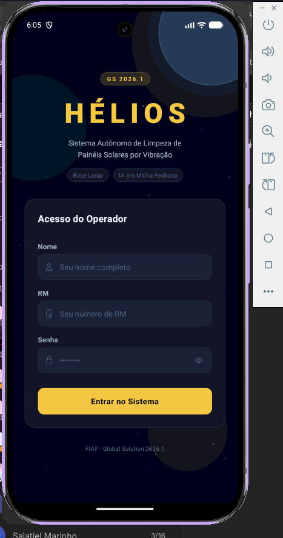
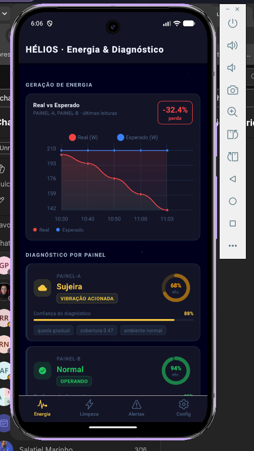
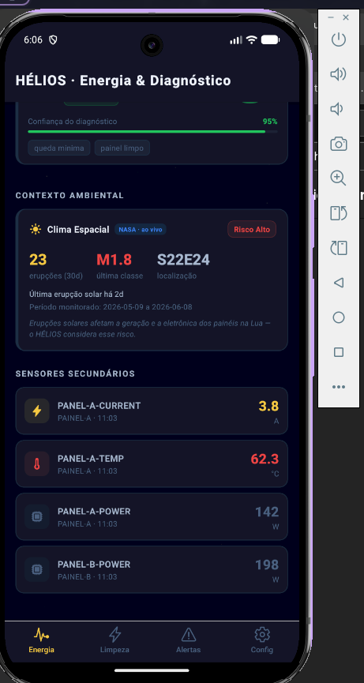
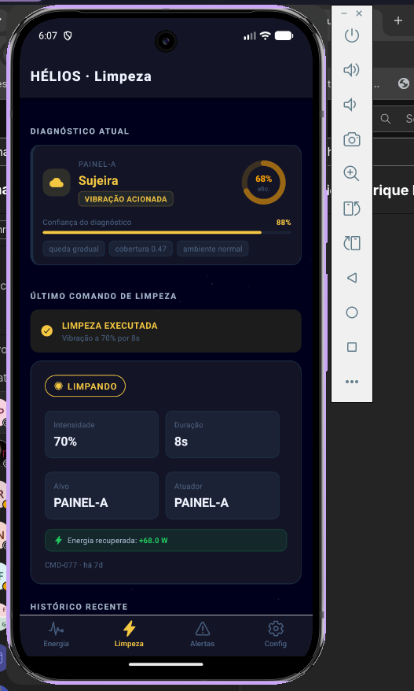
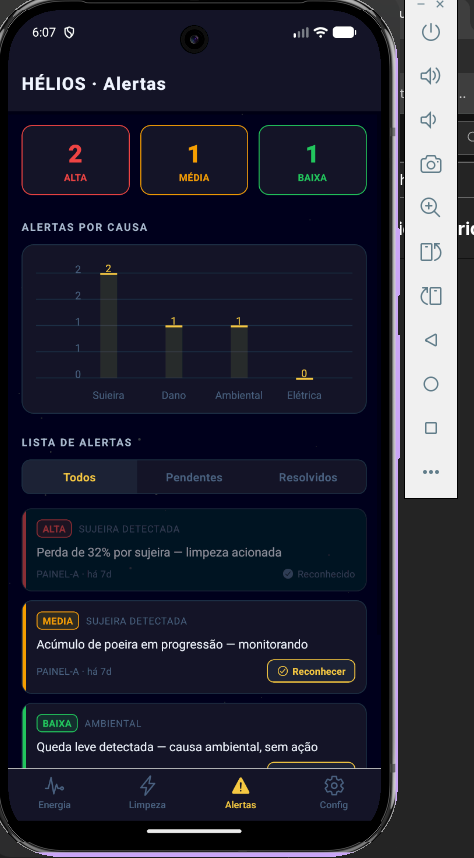
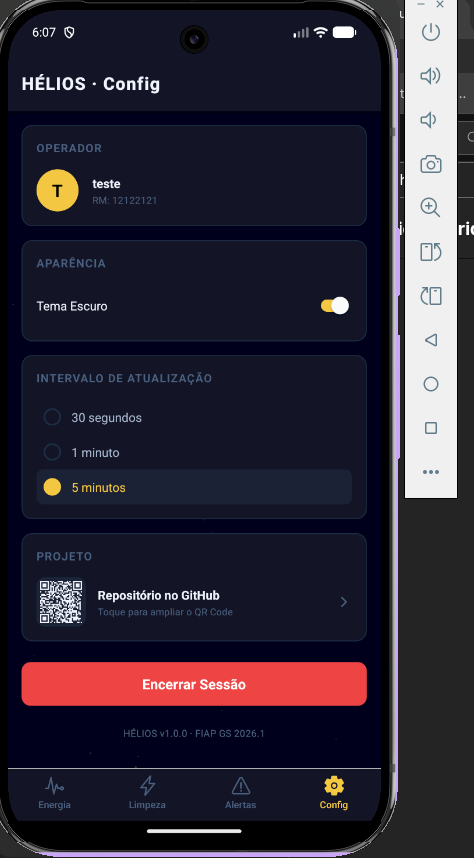

# HÉLIOS — App de Controle

**Global Solution 2026.1 · FIAP · Mobile Development & IoT**

**Vertente:** Sistemas autônomos e robótica para exploração espacial

> Painel de controle móvel do HÉLIOS: um sistema autônomo que percebe a queda de energia de painéis solares em uma base lunar, **diagnostica a causa cruzando sensores** e, se for sujeira, aciona a limpeza por vibração — tudo monitorado em tempo real.

---

## O que o app faz

O app é o **dashboard central** da Global Solution, consumindo o contrato de dados compartilhado entre as matérias (visão computacional, serviços Java, domínio C#). Ele mostra:

- **Energia & Diagnóstico** — gráfico de energia real vs esperada, perda atual e o diagnóstico de cada painel (sujeira, dano físico, sombra, falha elétrica...).
- **Clima Espacial (NASA ao vivo)** — erupções solares reais da API DONKI da NASA, que afetam a geração dos painéis na Lua.
- **Limpeza / Vibração** — status do último comando, mostrando se a limpeza foi **executada** (sujeira) ou **bloqueada** (ex.: painel trincado, onde vibrar pioraria o dano).
- **Alertas** — lista por severidade com gráfico por tipo de causa e reconhecimento persistente.
- **Configurações** — tema claro/escuro, intervalo de atualização e QR Code do projeto.

---

## Conexão com o tema (Indústria Espacial) + ODS

Na Lua, a poeira eletrostática cobre os painéis e derruba a geração de energia. Sem gente para limpar e com a comunicação Terra–Lua inviável para controle remoto, a decisão precisa acontecer **localmente e sozinha** (edge AI). O HÉLIOS limpa por **vibração — sem água e sem contato**.

**ODS atendidos:** 6 (água), 7 (energia limpa), 9 (inovação/infra), 11 (cidades sustentáveis), 13 (clima).

---

## Requisitos atendidos

| Requisito | Onde |
|---|---|
| Expo Router (3+ telas) | Login + 4 tabs |
| `useState` / `useEffect` | Em todas as telas e hooks |
| Context API | `AuthContext`, `ThemeContext`, `DataContext` |
| AsyncStorage (ler **e** escrever) | Sessão, alertas lidos, preferências |
| Formulário com validação | Login (nome, RM numérico, senha) |
| 2+ dashboards com gráficos | Energia (LineChart) + Alertas (BarChart) |
| Componentização | `SensorCard`, `DiagnosticoCard`, `AlertItem`, `VibracaoStatus` |
| UI tema espacial | Starfield animado + paleta espacial |


---

## Stack

- **React Native** + **Expo** (SDK 52) + **Expo Router**
- **TypeScript**
- **react-native-chart-kit** — gráficos
- **moti** + **react-native-reanimated** — animações
- **react-native-qrcode-svg** — QR Code
- **@react-native-async-storage/async-storage** — persistência

---

## Como executar

```bash
# 1. Instalar dependências
npm install --legacy-peer-deps

# 2. Iniciar o Expo
npx expo start

# 3. Abrir no celular (Expo Go) ou emulador
#    - Android: pressione 'a'
#    - Escaneie o QR Code com o app Expo Go
```

> O app roda com **dados simulados** (`data/mock.json`) no formato do contrato compartilhado da GS — não depende das outras matérias estarem prontas. A única chamada externa é a API da NASA (clima espacial).

### Login de demonstração
Qualquer nome + RM numérico + senha (mín. 4 caracteres). Ex.: `Gabriel` / `123456` / `1234`.

---

## Estrutura

```
helios-mobile/
  app/
    _layout.tsx              # providers + stack raiz
    login.tsx               # autenticação com validação
    (tabs)/
      index.tsx             # Energia & Diagnóstico (dashboard 1)
      limpeza.tsx           # Limpeza / Vibração
      alertas.tsx           # Alertas (dashboard 2)
      configuracoes.tsx     # Tema, intervalo, QR Code
  components/
    SensorCard, DiagnosticoCard, AlertItem, VibracaoStatus,
    SkeletonCard, AnimatedNumber, FadeInView,
    ClimaEspacialCard, QRCodeCard, StarfieldBackground
  contexts/                 # Auth, Theme, Data
  hooks/                    # useClimaEspacial (NASA)
  data/                     # types, mock.json, nasa.ts
  utils/                    # time.ts
  constants/                # Colors, Typography
```

---

## Contrato de dados

O app consome o mesmo JSON das outras matérias:

```json
// Leitura de energia (o gatilho)
{ "sensorId": "PANEL-A-POWER", "tipo": "potencia", "valor": 142.0,
  "esperado": 210.0, "unidade": "W", "ativoId": "PAINEL-A", "timestamp": "..." }

// Diagnóstico (saída do motor de diagnóstico C#)
{ "ativoId": "PAINEL-A", "causa": "SUJEIRA", "confianca": 0.88,
  "evidencias": ["queda_gradual", "cobertura_0.47"], "timestamp": "..." }

// Comando de limpeza (vibração modulada)
{ "comandoId": "CMD-77", "atuadorId": "VIB-PAINEL-A", "acao": "VIBRAR",
  "intensidade": 0.7, "duracaoSeg": 8, "alvoAtivoId": "PAINEL-A", "timestamp": "..." }
```

---

## Integrantes

- Gabriel Henrique Padula RM:554907
- Nome Completo | RM: 000000
- Nome Completo | RM: 000000
- Nome Completo | RM: 000000
- Nome Completo | RM: 000000

## Capturas de Tela

### Login


### Energia & Diagnóstico (Dashboard 1)



### Limpeza / Vibração


### Alertas (Dashboard 2)


### Configurações


---

*HÉLIOS — da poeira lunar à energia limpa na Terra.*
